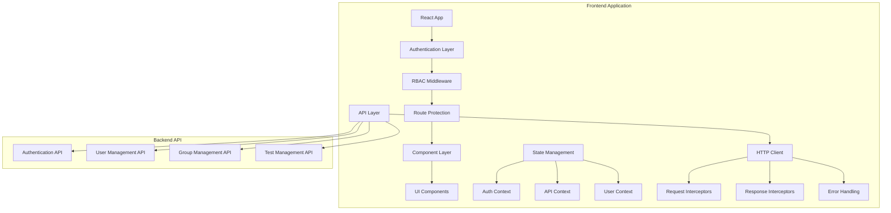
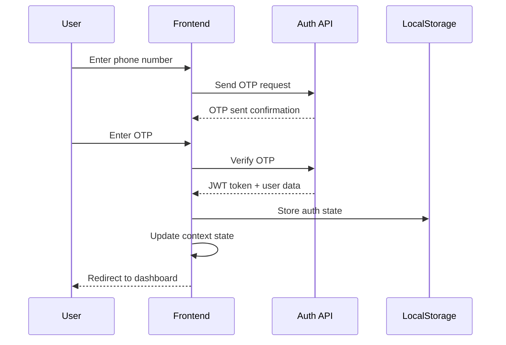
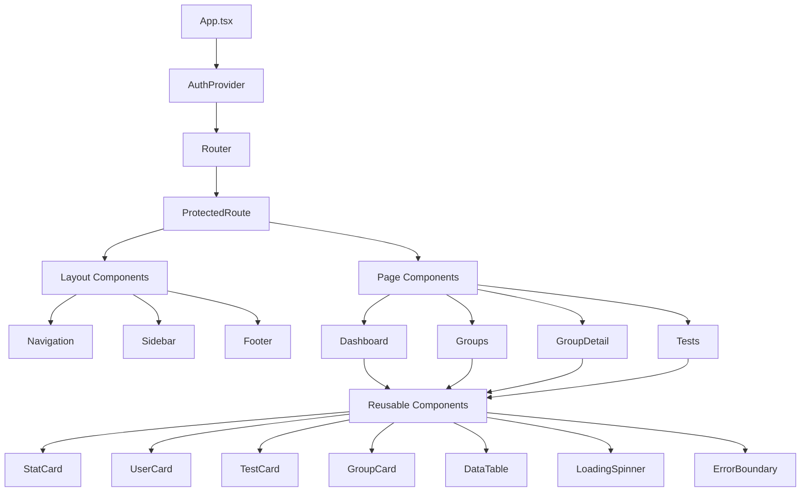
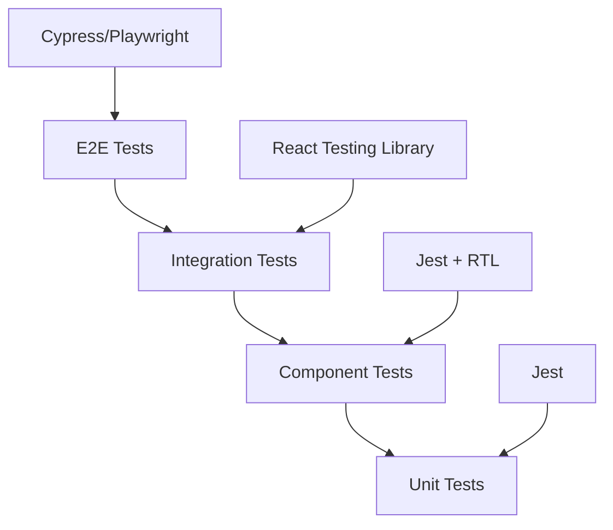

# Design Document

## Overview

This design document outlines the comprehensive refactoring of the Classmate Test web application to implement proper Role-Based Access Control (RBAC), API integration, and component reusability. The application currently uses mock data and has inconsistent RBAC implementation. This design will establish a robust authentication system, integrate with the backend API, and create a maintainable component architecture.

## Architecture

### High-Level Architecture



### Authentication Flow



### RBAC Permission Matrix

| Feature | Student | Manager | Admin | Teacher |
|---------|---------|---------|-------|---------|
| View Dashboard | ✓ | ✓ | ✓ | ✓ |
| Join Groups | ✓ | ✓ | ✓ | ✓ |
| Create Tests | ✗ | ✓ | ✓ | ✓ |
| Manage Group Members | ✗ | Limited | ✓ | ✓ |
| View All Test Results | ✗ | Own Tests | ✓ | ✓ |
| Group Settings | ✗ | ✗ | ✓ | ✓ |
| Billing Management | ✗ | ✗ | ✓ | ✗ |

## Components and Interfaces

### Core Interfaces

```typescript
// Authentication Types
interface User {
  id: string;
  name: string;
  mobile: string;
  email?: string;
  role: UserRole;
  permissions: Permission[];
  subscription?: SubscriptionInfo;
  profile: UserProfile;
}

interface AuthState {
  user: User | null;
  isAuthenticated: boolean;
  isLoading: boolean;
  token: string | null;
}

// Group Types
interface Group {
  id: string;
  name: string;
  description: string;
  type: 'teacher' | 'student';
  category: string;
  memberCount: number;
  maxMembers?: number;
  isPublic: boolean;
  inviteOnly: boolean;
  subscription: GroupSubscription;
  settings: GroupSettings;
}

// Test Types
interface Test {
  id: string;
  title: string;
  description: string;
  groupId: string;
  createdBy: string;
  status: 'draft' | 'scheduled' | 'active' | 'completed';
  startTime: Date;
  endTime: Date;
  duration: number;
  questions: Question[];
  participants: TestParticipant[];
  results?: TestResults;
}
```

### Component Architecture



### API Service Layer

```typescript
// Base API Client
class ApiClient {
  private baseURL: string;
  private token: string | null;
  
  constructor(baseURL: string) {
    this.baseURL = baseURL;
    this.setupInterceptors();
  }
  
  private setupInterceptors() {
    // Request interceptor for auth token
    // Response interceptor for error handling
    // Token refresh logic
  }
}

// Service Classes
class AuthService extends ApiClient {
  sendOTP(mobile: string): Promise<ApiResponse>;
  verifyOTP(mobile: string, otp: string): Promise<AuthResponse>;
  refreshToken(): Promise<TokenResponse>;
  logout(): Promise<void>;
}

class UserService extends ApiClient {
  getProfile(): Promise<User>;
  updateProfile(data: Partial<User>): Promise<User>;
  getGroups(): Promise<Group[]>;
}

class GroupService extends ApiClient {
  getGroups(filters?: GroupFilters): Promise<Group[]>;
  getGroup(id: string): Promise<Group>;
  createGroup(data: CreateGroupData): Promise<Group>;
  updateGroup(id: string, data: Partial<Group>): Promise<Group>;
  joinGroup(id: string): Promise<void>;
  leaveGroup(id: string): Promise<void>;
}
```

## Data Models

### User Management

```typescript
interface UserProfile {
  avatar?: string;
  bio?: string;
  education: EducationInfo[];
  preferences: UserPreferences;
  stats: UserStats;
}

interface EducationInfo {
  level: 'school' | 'college' | 'university';
  institution: string;
  course?: string;
  year?: number;
}

interface UserStats {
  testsAttended: number;
  groupsJoined: number;
  overallProgress: number;
  averageScore: number;
  streak: number;
}
```

### Group Management

```typescript
interface GroupSettings {
  allowPublicJoin: boolean;
  requireApproval: boolean;
  maxMembers?: number;
  testCreationRoles: UserRole[];
  resultVisibility: 'public' | 'members' | 'creators';
}

interface GroupSubscription {
  type: 'free' | 'premium' | 'teacher';
  status: 'active' | 'expired' | 'trial';
  expiresAt?: Date;
  billingInfo?: BillingInfo;
}

interface GroupMember {
  userId: string;
  role: UserRole;
  joinedAt: Date;
  status: 'active' | 'inactive' | 'banned';
  permissions: Permission[];
}
```

### Test Management

```typescript
interface Question {
  id: string;
  type: 'mcq' | 'text' | 'numeric';
  question: string;
  options?: string[];
  correctAnswer: string | number;
  points: number;
  explanation?: string;
}

interface TestParticipant {
  userId: string;
  startedAt?: Date;
  submittedAt?: Date;
  score?: number;
  answers: Answer[];
  status: 'not_started' | 'in_progress' | 'completed';
}

interface TestResults {
  totalParticipants: number;
  averageScore: number;
  highestScore: number;
  lowestScore: number;
  passRate: number;
  questionAnalytics: QuestionAnalytics[];
}
```

## Error Handling

### Error Types and Handling Strategy

```typescript
enum ErrorType {
  NETWORK_ERROR = 'NETWORK_ERROR',
  AUTH_ERROR = 'AUTH_ERROR',
  PERMISSION_ERROR = 'PERMISSION_ERROR',
  VALIDATION_ERROR = 'VALIDATION_ERROR',
  SERVER_ERROR = 'SERVER_ERROR'
}

interface AppError {
  type: ErrorType;
  message: string;
  code?: string;
  details?: any;
}

class ErrorHandler {
  static handle(error: AppError): void {
    switch (error.type) {
      case ErrorType.AUTH_ERROR:
        // Clear auth state and redirect to login
        break;
      case ErrorType.PERMISSION_ERROR:
        // Show permission denied message
        break;
      case ErrorType.NETWORK_ERROR:
        // Show network error with retry option
        break;
      default:
        // Show generic error message
    }
  }
}
```

### Global Error Boundary

```typescript
class GlobalErrorBoundary extends React.Component {
  // Catch JavaScript errors anywhere in component tree
  // Log errors to monitoring service
  // Show fallback UI
  // Provide error recovery options
}
```

## Testing Strategy

### Testing Pyramid



### Test Categories

1. **Unit Tests**
   - API service functions
   - Utility functions
   - Custom hooks
   - Pure components

2. **Component Tests**
   - Component rendering
   - User interactions
   - Props handling
   - State management

3. **Integration Tests**
   - Authentication flow
   - API integration
   - Route protection
   - Context providers

4. **E2E Tests**
   - Complete user journeys
   - Cross-browser compatibility
   - Mobile responsiveness
   - Performance testing

### Mock Strategy

```typescript
// API Mocking
const mockApiClient = {
  auth: {
    sendOTP: jest.fn(),
    verifyOTP: jest.fn(),
    refreshToken: jest.fn()
  },
  users: {
    getProfile: jest.fn(),
    updateProfile: jest.fn()
  },
  groups: {
    getGroups: jest.fn(),
    createGroup: jest.fn()
  }
};

// Context Mocking
const mockAuthContext = {
  user: mockUser,
  isAuthenticated: true,
  login: jest.fn(),
  logout: jest.fn()
};
```

## Performance Considerations

### Code Splitting Strategy

```typescript
// Route-based code splitting
const Dashboard = lazy(() => import('./pages/Dashboard'));
const Groups = lazy(() => import('./pages/Groups'));
const Tests = lazy(() => import('./pages/Tests'));

// Component-based code splitting
const TestCreator = lazy(() => import('./components/TestCreator'));
const GroupManager = lazy(() => import('./components/GroupManager'));
```

### Caching Strategy

```typescript
// React Query configuration
const queryClient = new QueryClient({
  defaultOptions: {
    queries: {
      staleTime: 5 * 60 * 1000, // 5 minutes
      cacheTime: 10 * 60 * 1000, // 10 minutes
      retry: 3,
      refetchOnWindowFocus: false
    }
  }
});

// Cache keys
const QUERY_KEYS = {
  user: ['user'],
  groups: ['groups'],
  group: (id: string) => ['group', id],
  tests: ['tests'],
  test: (id: string) => ['test', id]
};
```

### Bundle Optimization

1. **Tree Shaking**: Remove unused code
2. **Dynamic Imports**: Load components on demand
3. **Asset Optimization**: Compress images and fonts
4. **CDN Usage**: Serve static assets from CDN
5. **Service Worker**: Cache API responses and assets

## Security Considerations

### Authentication Security

1. **JWT Token Management**
   - Store tokens securely
   - Implement token refresh
   - Handle token expiration
   - Clear tokens on logout

2. **API Security**
   - HTTPS only communication
   - Request/response validation
   - Rate limiting
   - CORS configuration

3. **Client-Side Security**
   - Input sanitization
   - XSS prevention
   - CSRF protection
   - Secure localStorage usage

### Permission Validation

```typescript
// Client-side permission checking
const usePermissions = () => {
  const { user } = useAuth();
  
  const hasPermission = (permission: Permission): boolean => {
    return user?.permissions.includes(permission) || false;
  };
  
  const hasRole = (role: UserRole): boolean => {
    return user?.role === role;
  };
  
  const canAccessGroup = (group: Group): boolean => {
    // Complex permission logic
  };
  
  return { hasPermission, hasRole, canAccessGroup };
};
```

## Migration Strategy

### Phase 1: Foundation (Week 1-2)
- Set up new authentication system
- Implement API client and services
- Create base components and utilities
- Set up error handling and loading states

### Phase 2: Core Features (Week 3-4)
- Migrate authentication flow
- Implement RBAC system
- Update routing and protection
- Integrate user management APIs

### Phase 3: Group Management (Week 5-6)
- Implement group APIs integration
- Update group components
- Add group type handling
- Implement member management

### Phase 4: Test Management (Week 7-8)
- Integrate test APIs
- Update test components
- Implement result publishing
- Add test analytics

### Phase 5: Polish & Testing (Week 9-10)
- Component refactoring
- Performance optimization
- Comprehensive testing
- Bug fixes and improvements

## Deployment Considerations

### Environment Configuration

```typescript
interface EnvironmentConfig {
  API_BASE_URL: string;
  APP_ENV: 'development' | 'staging' | 'production';
  ENABLE_ANALYTICS: boolean;
  LOG_LEVEL: 'debug' | 'info' | 'warn' | 'error';
}
```

### Build Optimization

1. **Production Build**
   - Minification and compression
   - Source map generation
   - Bundle analysis
   - Performance budgets

2. **CI/CD Pipeline**
   - Automated testing
   - Code quality checks
   - Security scanning
   - Deployment automation

This design provides a comprehensive foundation for implementing the RBAC system, API integration, and component refactoring while maintaining scalability, security, and performance.